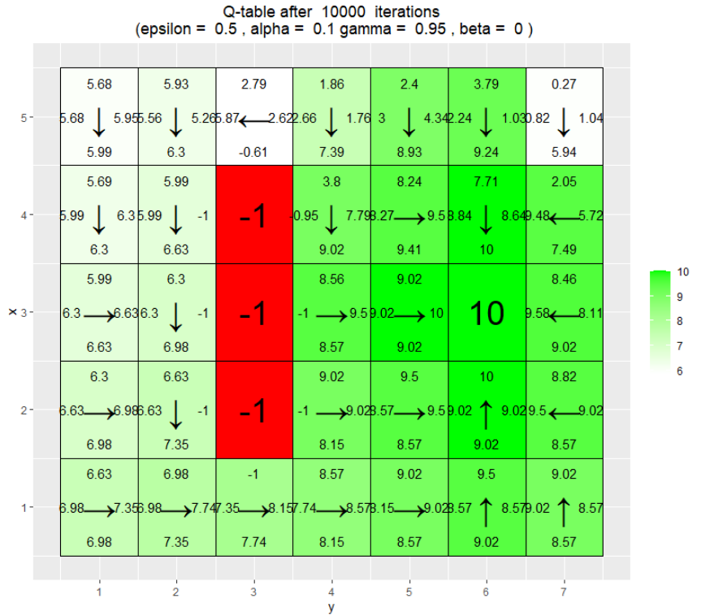
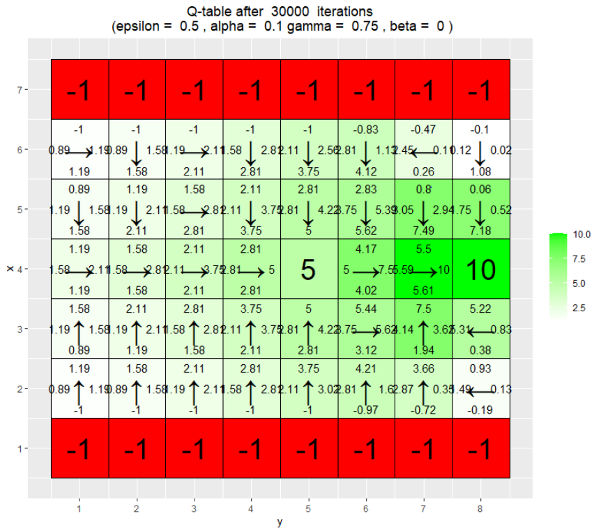
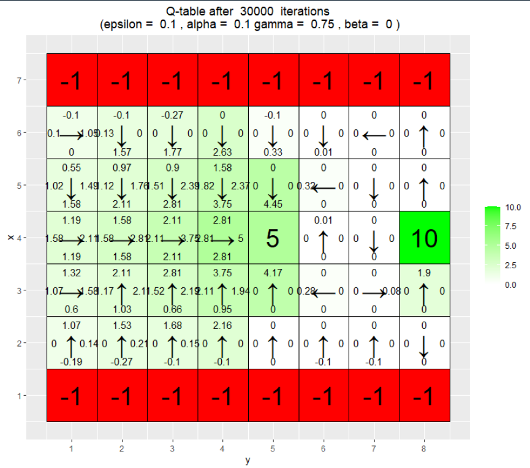
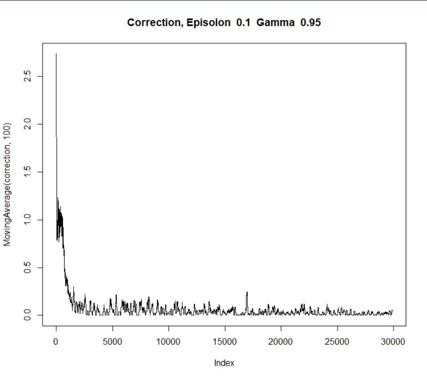

```{r Set up, include=FALSE}
knitr::opts_chunk$set(echo = TRUE)
```


## Environment A

Below are the environments after 10, 100 and 1000 and 10000 runs done with the Greedy Policy. Questions and answers under images.

- *What has the agent learned after the first 10 episodes?*


As one can see in the image above the agent has not learned much in the first 10 iterations. The only q-value that has been updated is after having gotten a negative reward in $x=3,y=2$.

- *Is the final greedy policy (after 10000 episodes) optimal? Why / Why not ?*



The image above shows the path after $10 000$ iterations. The policy is almost optimal apart from mainly the area around $(4,2)$ where the arrows should be up instead and in $(1,3)$.

- *Does the agent learn that there are multiple paths to get to the positive reward ? If not, what could be done to make the agent learn this ?*

Yes, but the agent. Although it it mainly taking the path below the negative reward, which decreases the amount of possible paths it can take.

## Environment B

As $\gamma$ denounces the discount factor that means that it adjusts how much of the values of the Q-table should affect the new updated Q-value, called correction. One can see this quite clearly if one compares $\gamma=0.75$ with $\gamma=0.95$.




The big difference one can see in the images above is how all the q-values are a lot higher when $\gamma=0.95$.

One more thing that is clearly visible in these images is the effect of $\epsilon$. $\epsilon$ is the threshold for exploration. As $\epsilon=0.5$ in both of the above that means than in each evaluation of the $\epsilon$-greedy policy there is a $50 \%$ chance that it instead takes a random step. That means that it has a high chance of exploring more of the tiles. If one compares this with where $\epsilon=0.1$ like the images below the results is quite clear.




As one can see it almost never takes a step beyond the tile with a reward of 5 as the low exploration rate makes it go straight to the tile with a reward of 5. This can also be seen in the graph below showing the rolling mean of the rewards where it aslmost always 5. 


One can also look at the correction graph. The correction graph (see below) shows the correction of each step. This shows how much of a correction that occurs with each step. 




The difference between these two are quite significant. The higher value of $\epsilon$ leads to more variation and mainly a higher correction overall. What this means is that with each episode the correction of the q values are higher. The reason for is that the higher the probability of acting greedily is the more different paths and more will be discorvered and the more correction is done each step and episode.

There are more to be analysed from the data and the graphs, but above is the key takeaways that I did of the graphs.

## Environment C

$\beta$ is the slipping factor. The slipping factor can make the action "slip" and make the action be something different. The $\beta$ is the probability of the agent slipping to the side when trying to move with each step. So as one can see in the examples below - the higher the $\beta$ the higher is the probability that the agent takes the path where $x=3$ as there is a smaller chance of it slipping in to the negative reward.

 


## Environment D

- *Has the agent learned a good policy? Why / Why not?*

Yes, the agent has learned a good policy as in almost all of the cases the agent would end up at the goal no matter what the starting position would be.

Example:


Example with one bad probability in $(1,4)$:


- *Could you have used the Q-learning algorithm to solve this task?*

No, it would not work as the goals move, which Q-learning would not be able to handle.


## Environment E

- *Has the agent learned a good policy? Why / Why not?*

The policy is worse than in Environment D as there are a lot more cases where if the agent where placed in a random tile in the grid they would not end up at the goal. The reason for this is that it learns to just move generally from the top row to to the goal, which does not work as the goal can be in any of the bottom tiles.

Example of a bad policy where the agent would end up almost stuck at the right edge most of the time: 


- *If the results obtained for environments D and E differ, explain why.*

The results differ for the reason stated in the question above.


